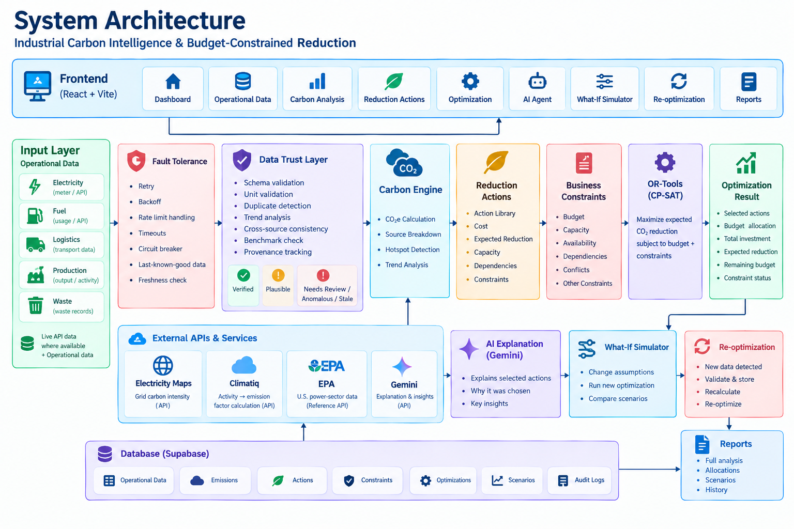
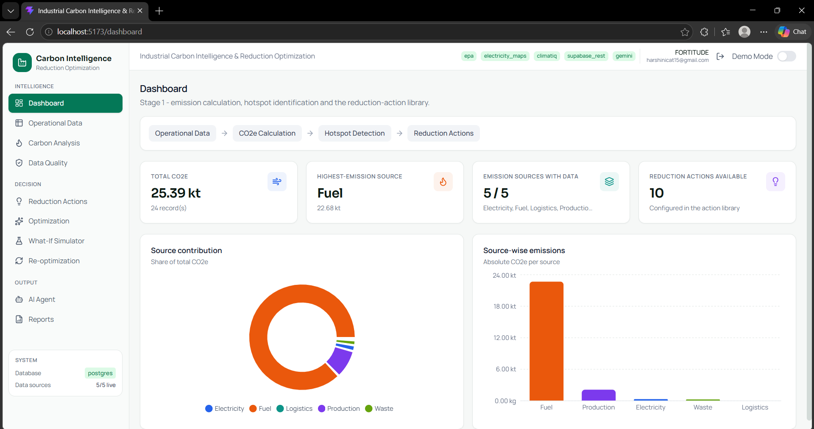
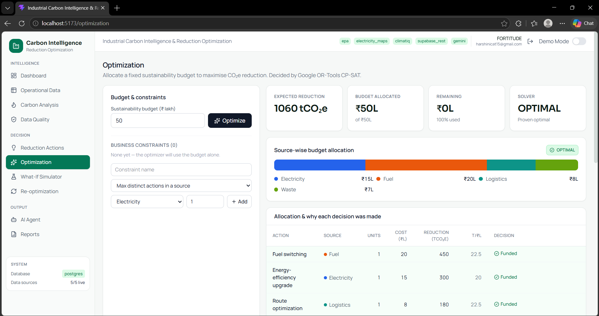
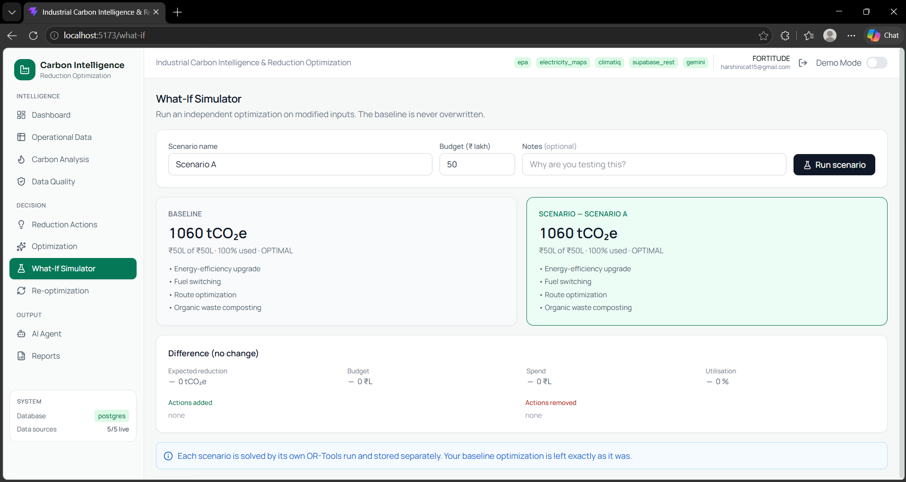

# Industrial Carbon Intelligence & Budget-Constrained Reduction Optimization

**Problem Statement: SU-04 — Industrial Carbon Intelligence & Reduction Engine**
**Domain 03 — Sustainability**

---

## 1. Problem Statement

> Organizations generate emissions across multiple operational sources including electricity,
> fuel, logistics, production and waste. **Merely calculating total emissions does not tell an
> organization which actions will provide the greatest reduction.** Build a carbon-intelligence
> system that estimates operational emissions and recommends reduction strategies under
> realistic business constraints. A core challenge is the **fixed sustainability budget**: given
> limited resources for sustainability initiatives, determine how they should be allocated to
> maximize carbon reduction.
>
> **Key challenge — Transform carbon measurement into an actionable optimization problem.**

### Why a carbon calculator is not enough

Knowing you emit 620 tonnes tells you your score. It does not tell you your next move.

A plant with ₹1 crore for sustainability has more candidate projects than money, and the
obvious approach — rank actions by cost-per-tonne and buy down the list until the money runs
out — is **provably not optimal** when projects are indivisible.

On our own demo data with a ₹100L budget, that greedy approach spends ₹95L and reaches
1,960 tCO₂e/yr. The optimizer spends the full **₹100L and reaches 2,040 tCO₂e/yr** —
**+80 tCO₂e/yr from the same budget**, confirmed against an exhaustive search of all 1,024
possible project subsets. That gap is the entire project.

---

## 2. Proposed Solution

A system that carries an organization all the way from raw activity data to a **funded,
constraint-respecting decarbonisation plan**.

```text
Operational data          electricity | fuel | logistics | production | waste
        |
        v
Data trust validation     6 deterministic checks; implausible records held for review
        |
        v
Emission calculation      activity data x emission factor (Climatiq)
        |
        v
Hotspot identification    source_co2e / total_co2e x 100 (deterministic)
        |
        v
Reduction action library  cost + expected reduction + capacity per action
        |
        v
Business constraints      max actions per source | mutual exclusion | spend caps
        |
        v
Fixed sustainability budget
        |
        v
OR-TOOLS CP-SAT           maximize SUM(reduction * x) s.t. SUM(cost * x) <= budget
        |
        v
Budget allocation         which actions to fund, and why each was chosen or rejected
        |
        v
Expected carbon reduction proven optimal when objective == best bound
```

**The optimizer is authoritative. The AI layer explains the result in words; it never makes or
alters the allocation.**

---

## 3. Key Features

Every item below is implemented and working in this repository.

| Feature | What it does |
|---|---|
| Multi-source emission calculation | Five sources, each with its own activity unit — no universal kWh assumption |
| Data trust layer | 6 checks (schema, duplicate, intensity benchmark, historical trend, cross-source, provenance) → trust score → human Approve/Reject |
| Hotspot analysis | Deterministic per-source totals and contribution %, with provenance on every value |
| Reduction action library | Full CRUD; every value carries its evidence source and a demo-assumption flag |
| Budget allocation optimization | Google OR-Tools CP-SAT, with business constraints and proof of optimality |
| Explainability | Per-action reason for every funding decision, including why an action was rejected |
| What-if simulation | Independent scenario runs; the baseline is never overwritten |
| Re-optimization | Re-run on changed inputs with a full change history |
| AI-assisted explanation | Explains stored results from a backend-built context only, with automatic model failover |
| Reports | CSV and printable HTML, generated from database values — never from the AI |
| Authentication & multi-tenancy | Company registration, bcrypt passwords, JWT sessions; each company sees only its own data |
| Administrator console | Platform-wide view of every company, with audit log |
| Fault tolerance | Retries, exponential backoff, circuit breaker, stale-cache fallback, source health |

---

## 4. Architecture



```text
React 19 + TypeScript + Vite + Tailwind + Recharts
        |  Axios (the browser talks ONLY to FastAPI — never to a vendor API)
        v
FastAPI ---> Climatiq          activity data -> CO2e            (calculated)
        |    Electricity Maps  grid carbon intensity            (api_derived)
        |    EPA CAMPD         US power-sector measured CO2     (measured, optional)
        |    Gemini            explanation layer only
        v
Auth + tenancy ---> Fault tolerance ---> Data trust ---> Supabase PostgreSQL
                                                              |
                                                              v
               Carbon analysis -> Hotspots -> OR-Tools CP-SAT -> Allocation
```

### Layering rule

```text
routes/         HTTP only — validate input, call a service, shape the response
services/       business logic — no HTTP, no vendor SDKs
integrations/   vendor APIs — no business logic
optimization/   pure math — no FastAPI, no database, no vendor imports
```

Each layer only calls downward, which is why the optimizer is unit-testable with no server
running and no database.

---

## 5. Technology Stack

| Layer | Technology |
|---|---|
| Frontend | React 19.2 · TypeScript 6.0 · Vite 8.3 · Tailwind CSS 4.3 · Recharts 3.10 · React Router 7.18 · Axios 1.20 |
| Backend | Python 3.14 · FastAPI 0.141 · Pydantic 2.13 · SQLAlchemy 2.0 · httpx 0.28 |
| Database | Supabase PostgreSQL (psycopg v3) |
| Optimization | Google OR-Tools 9.15 (CP-SAT) |
| Emission factors | Climatiq API (`data_version ^37`) |
| Grid carbon intensity | Electricity Maps API (India zones IN-SO / IN-NO / IN-WE / IN-EA / IN-NE) |
| Measured reference data | EPA Clean Air Markets (CAMPD) — optional connector |
| AI | Google Gemini via `google-genai` 2.24 (model configurable, with failover chain) |
| Auth | bcrypt 5.0 (cost 12) · PyJWT 2.14 (HS256) |

---

## 6. Project Structure

```text
KPR_Hackthon-
├── README.md
├── .gitignore
│
├── docs/
│   └── images/                    architecture · dashboard · optimization · what-if
│
├── backend/
│   ├── app/
│   │   ├── main.py                FastAPI entrypoint
│   │   ├── core/                  config · logging · security · deps · fault_tolerance
│   │   ├── optimization/          models · constraints · optimizer  <- CP-SAT lives here
│   │   ├── integrations/          climatiq · electricity_maps · epa · base
│   │   ├── ai/                    gemini_client
│   │   ├── services/              emission · hotspot · action · optimization · trust
│   │   │                           climatiq · demo_data
│   │   ├── routes/                auth · emissions · hotspots · actions
│   │   │                           optimization · ai · trust · reports
│   │   ├── models/                SQLAlchemy models
│   │   ├── schemas/               Pydantic request/response models
│   │   ├── repositories/          data-access helpers
│   │   ├── utils/                 shared helpers
│   │   └── db/                    engine + session
│   ├── tests/                     test_stage1.py
│   ├── sample_data/               CSVs for testing, valid and deliberately invalid
│   ├── requirements.txt
│   └── .env.example
│
├── frontend/
│   ├── src/
│   │   ├── pages/                 Landing · Dashboard · OperationalData · CarbonAnalysis
│   │   │                           DataQuality · ReductionActions · Optimization
│   │   │                           AIAgent · WhatIf · Reoptimization · Reports · AdminPanel
│   │   ├── components/            Layout · ui · charts · optimization · Comparison
│   │   ├── contexts/              AuthContext
│   │   ├── services/              api.ts (single Axios client)
│   │   ├── types/                 TypeScript API types
│   │   └── utils/                 formatting, source labels and colours
│   └── package.json
│
└── supabase/
    └── migrations/                0001_init.sql · 0002_remove_facility_from_core.sql
```

---

## 7. Setup

### 7.1 Clone

```bash
git clone https://github.com/harsh-15-2006/KPR_Hackthon-.git
cd KPR_Hackthon-
```

### 7.2 Backend

```bash
cd backend
python -m venv venv
.\venv\Scripts\python.exe -m pip install -r requirements.txt
if not exist .env copy .env.example .env
```

> **Never run a bare `copy .env.example .env`** — it silently overwrites an existing `.env` and
> destroys every key in it. The guarded form above is safe to re-run.

Fill in `backend\.env` (see [Environment Variables](#8-environment-variables)), then:

```bash
.\venv\Scripts\python.exe -m uvicorn app.main:app --reload
```

Backend runs at `http://127.0.0.1:8000` · API docs at `http://127.0.0.1:8000/docs`

> Calling `venv\Scripts\python.exe` directly avoids PowerShell's execution-policy block on
> `Activate.ps1`.

### 7.3 Frontend

In a second terminal:

```bash
cd frontend
npm install
npm run dev
```

Open `http://localhost:5173`.

> Vite proxies `/api` to the backend, so no CORS setup is needed in development.
> Start the backend first.

### 7.4 First use

1. Open the app → **Register a company** → this creates your workspace and owner account.
2. **Operational Data** → add activity data, or upload `backend/sample_data/valid_full.csv`.
3. **Optimization** → set a budget → **Optimize**.

To create the platform administrator, set `ADMIN_SETUP_KEY` in `.env` and POST once to
`/api/auth/bootstrap-admin`. It refuses after the first administrator exists.

---

## 8. Environment Variables

All are server-side only. **Never create `VITE_` copies — those reach the browser.**
`.env` is gitignored; `.env.example` holds placeholders only.

| Variable | Required | Notes |
|---|---|---|
| `DATABASE_URL` | for persistence | Supabase Postgres — use the **Session pooler** (see below) |
| `JWT_SECRET` | yes | Must be ≥ 32 bytes. `python -c "import secrets;print(secrets.token_urlsafe(48))"` |
| `ADMIN_SETUP_KEY` | for admin bootstrap | Gate for creating the first administrator |
| `CLIMATIQ_API_KEY` | for real factors | Blank ⇒ Demo Mode |
| `CLIMATIQ_DATA_VERSION` | no | `^37` |
| `ELECTRICITY_MAPS_API_KEY` | for grid intensity | |
| `ELECTRICITY_MAPS_DEFAULT_ZONE` | no | e.g. `IN-SO` |
| `GEMINI_API_KEY` | for AI | Together with `GEMINI_ENABLED=true` |
| `GEMINI_MODEL` | for AI | Primary model id, e.g. `gemini-2.5-flash` |
| `GEMINI_FALLBACK_MODELS` | no | Comma-separated ids tried if the primary fails — see §12 |
| `GEMINI_ENABLED` | for AI | `true` / `false` |
| `EPA_API_KEY` | optional | EPA's public `DEMO_KEY` works for testing |
| `CORS_ORIGINS` | no | Defaults to the local dev ports |
| `LOG_LEVEL` | no | |
| `REFRESH_INTERVAL_SECONDS` | no | |

### Two Supabase gotchas that cost real time

1. **The Direct connection is IPv6-only.** `db.<ref>.supabase.co` publishes only an AAAA
   record, so on an IPv4 network it can never resolve. Use
   **Project Settings → Database → Connection string → Session pooler** (port `5432`).
   Avoid the Transaction pooler on `6543` — it breaks SQLAlchemy's prepared statements.
2. **A password containing `@ : / #` breaks URL parsing.** The app percent-encodes it
   automatically, so paste the connection string verbatim — do not hand-edit it, and do not
   delete the special character (that changes the password).

If the database is unreachable the app does not crash: it falls back to local SQLite, keeps
working, and reports the reason in `/api/health` and in the UI header.

---

## 9. Data Provenance — the core honesty rule

Every stored value carries a `data_class`:

| Class | Meaning |
|---|---|
| `measured` | Reported/measured by an external regulated source (EPA CAMPD) |
| `api_derived` | Returned by an external API (Electricity Maps grid intensity) |
| `calculated` | Computed by this system (activity × emission factor) |
| `demo_assumption` | A prototype assumption — **not** a measurement |

Enforced in code, not by convention:

- A failed API call never becomes a fabricated value — it returns an error, or clearly
  labelled `STALE` cached data.
- A missing measurement stays missing. It is never zero-filled.
- An unrecognised CO₂e unit raises rather than being assumed to be kilograms.
- Reduction-action costs are `is_demo_assumption = true` unless given an evidence source.

---

## 10. Optimization Model

```text
maximize    SUM_i  expected_reduction_i * x_i
subject to  SUM_i  cost_i * x_i  <=  budget
            0 <= x_i <= capacity_i,  x_i integer
            + configured business constraints
```

This is a **bounded knapsack problem (NP-hard)**, solved exactly by CP-SAT.

- Costs scale with `ceil`, reductions with `floor`, so integer rounding can never permit a
  real-money overspend.
- Boolean indicators track "is this action funded at all", so counting constraints count
  distinct actions, not units.
- **Deterministic:** `num_workers=1`, `random_seed=42` — the same inputs always give the same
  allocation, which is what makes a stored run reproducible.
- `objective_value == best_bound` ⇒ **proven optimal**.
- Statuses: `OPTIMAL` · `FEASIBLE` · `INFEASIBLE` · `UNKNOWN` · `MODEL_INVALID`, each with a
  plain-English explanation.

### Why an LLM cannot replace this

Given the same action library and the same ₹100L budget, a language model reproduced the greedy
answer — **1,960 tCO₂e for ₹95L**, leaving ₹5L unspent and 80 tCO₂e/yr on the table,
consistently across repeated runs. CP-SAT returns **2,040 tCO₂e** and proves that no better
allocation exists. Choosing indivisible projects under a budget is a combinatorial search
problem, not a language problem.

---

## 11. Data Trust Layer

Six deterministic checks run on every record. **No machine learning is involved** — the
repository imports no ML library.

`Schema/range` · `Duplicate` · `Intensity benchmark` · `Historical trend (median-ratio)` ·
`Cross-source consistency` · `Provenance`

Trust score starts at 100; each failed rule subtracts. States:
`verified` → `plausible` → `needs_review` → `anomalous`.
The last two are held back from carbon analysis until a human clears them at `/data-quality`.

> **This is not fraud detection.** It flags records that are inconsistent, implausible or
> unattributed and routes them to a person. It cannot prove a value is true and never alleges
> wrongdoing. Approve/Reject are human decisions — the AI cannot make them.

---

## 12. AI Explanation Layer

The AI is **not a core dependency** (`IS_CORE_DEPENDENCY = False`). Every figure in the product
comes from the database and OR-Tools; the AI only narrates them. If it is unavailable the API
returns `available: false` plus the real backend context, and nothing else degrades.

**Guardrails enforced in code, not merely requested in a prompt:**

- The model receives only a backend-built JSON context — it cannot reach past what it is handed.
- It is forbidden from inventing figures or overriding the optimizer.
- A failure never produces a fabricated answer.

**Model failover.** `GEMINI_MODEL` is the primary; `GEMINI_FALLBACK_MODELS` is an ordered,
comma-separated list tried when a model returns 503 / 429 / 404. Because a 503 means *that
model is saturated right now*, models with a fallback behind them are tried once and abandoned
immediately — only the last id in the chain gets the full retry-with-backoff budget. A rejected
API key stops the chain at once instead of failing identically on every model.

The chat response reports `requested_model`, the `model` that actually answered, and
`used_fallback`, so a failover is visible rather than silent. Check the active chain with:

```bash
curl.exe -s http://127.0.0.1:8000/api/ai/status
```

> Model availability differs per API key — verify ids against your own key rather than trusting
> documentation. Avoid `-latest` aliases: Google hot-swaps them without notice.

---

## 13. Security

- Passwords are bcrypt-hashed (cost 12). Plaintext is never stored, logged or returned.
- JWT HS256; a secret shorter than 32 bytes is refused and replaced at startup.
- Tenancy is enforced **server-side in one place**, so a company account cannot read another
  company's data even by crafting a request with a different `scope_key`.
- Sign-in returns an identical message for an unknown email and a wrong password, so the
  endpoint cannot be used to enumerate accounts.
- Logs redact API keys, bearer tokens, `?api_key=` query strings and exception tracebacks.
- `/api/health` returns booleans and status strings only — never a key.

---

## 14. Testing

```bash
cd backend
.\venv\Scripts\python.exe -m pytest tests\ -q
```

```bash
cd frontend
npm run build
```

`backend/sample_data/` contains CSVs for testing:

| File | Purpose |
|---|---|
| `valid_full.csv` | Valid rows across all five sources |
| `sample_emissions.csv` | Small starter set |
| `invalid_examples.csv` | Deliberate errors, one per validation rule |
| `missing_columns.csv` | Rejected outright |
| `duplicate_rows.csv` | Triggers the data-trust duplicate check |

> **Known state of the suite:** `tests/test_stage1.py` was written before authentication was
> added, so several tests now receive `401` where they expect `200`/`422`. They need auth
> fixtures. This is a test-harness gap, not a product defect — the endpoints behave correctly
> when called with a session token.

> If tests fail with `no such column`, delete the dev database and restart. SQLAlchemy's
> `create_all()` only CREATEs tables — it never ALTERs them — so a database file from an older
> model silently keeps the old columns.

---

## 15. Screenshots

### Dashboard

Overview of operational carbon data, emission hotspots, reduction opportunities, budget
allocation and optimization results.



### Budget Allocation Optimization

The CP-SAT result: which actions are funded, the spend against budget, the expected reduction,
and the reason each action was selected or rejected.



### What-If Simulation

Evaluate an independent scenario by changing inputs and observing the resulting optimization and
carbon-reduction outcome **without overwriting the baseline**.



---

## 16. Known Limitations

- Reduction-action costs and reductions are **configured project assumptions**, not industrial
  measurements. Labelled `DEMO ASSUMPTION` throughout the UI.
- Demo Mode emission factors are illustrative. Not measurements, not from Climatiq.
- The data-trust layer **flags, it does not prove**. No fraud claim is made or implied.
- Intensity benchmark bands are order-of-magnitude sanity ranges defined for this prototype,
  not published industry benchmarks.
- EPA CAMPD covers **US power-sector facilities only**. It is an optional reference connector;
  no core workflow depends on it.
- Electricity Maps reports **grid** carbon intensity, not a facility's own consumption.
- Reports export CSV and printable HTML. No native PDF engine is bundled — use the browser's
  Print → Save as PDF.
- A company is currently a single owner account; user invites and password reset are not built.
- No background scheduler — re-optimization is manual or triggered by new data.
- `tests/test_stage1.py` predates authentication and needs auth fixtures (see §14).

---

## 17. Team

- **Team name:** TEAM FOURTITUDE
- **Institution:** CIT
- **Problem Statement:** SU-04 — Industrial Carbon Intelligence & Reduction Engine
  (Domain 03 — Sustainability)

